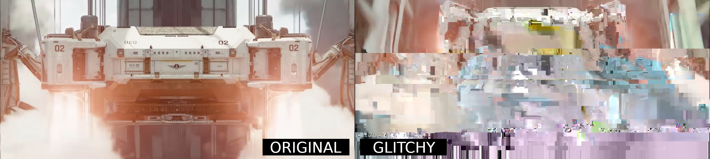

# make-it-glitch
[](https://github.com/yinguobing/make-it-glitch/actions/workflows/cmake.yml)

Minimal C++ code for generating glitchy video with FFMPEG.



All these features implemented with FFMPEG!
- Support most video files
- Automatic hardware acceleration
- Color space conversion: YUV to RGB

## Getting Started

These instructions will get you a copy of the project up and running on your local machine for development and testing purposes.

### Prerequisites
You will need these libraries for development:
- FFMPEG 4.3.3 or later
- OpenCV 4.5.4 or later, if you want any image postprocessing
- CUDA 11.8, only if you want CUDA NVDEC hardware accelerated decoding
- CMake 3.16, or later
- A C++ 17 compatible compiler

### Build
First, clone the code.
```bash
git clone https://github.com/yinguobing/make-it-glitch.git
```

Then build with cmake.
```bash
cd make-it-glitch
mkdir build && cd build
cmake ..
make
```

The executable file `glitch` will be found in the `build` directory.

### Run
From the `build` directory, run
```bash
./glitch your-video-file.mp4 output-image-dir
```

Enjoy!

### Modify
In case you want to know how this is made, the essential code could be found in `essential.cpp`.

## License
See the LICENSE file for details.

## Authors
Yin Guobing (尹国冰) - https://yinguobing.com

## References
FFMPEG examples: https://ffmpeg.org/doxygen/4.3/examples.html
